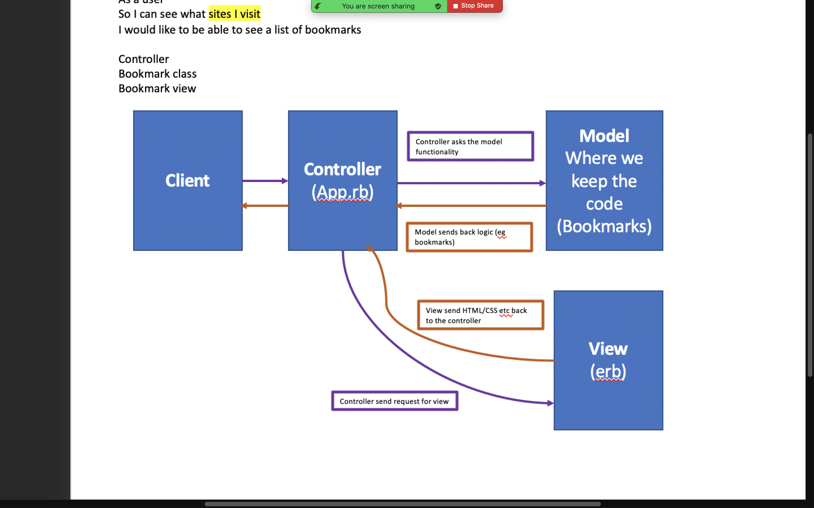

# Bookmark Manager

This code is intended as a supplementary guide for [bookmark manager](https://github.com/makersacademy/course/tree/master/bookmark_manager). The commits on master branch roughly correspond with the walkthroughs provided in the challenge.

## User Stories

```
As a user so I can see what sites I have visited I would like to be able to see a list of my bookmarks

As a user so that I can stor bookmarks to review later I want to add a bookmark to my app


```

## Domain Model



 ## Database Creation

 - Connect to psql
 - Connect to `psql` and create the `bookmark_manager` and `bookmark_manager_test` databases:
 - Create the database using the psql command CREATE DATABASE database_name; 
 - To set up the appropriate tables, connect to each database in `psql` and run the SQL scripts in the `db/migrations` folder in the given order
 - Connect to the database using the pqsl command \c bookmark_manager;
 - Run the query we have saved in the file 01_create_bookmarks_table.sql
